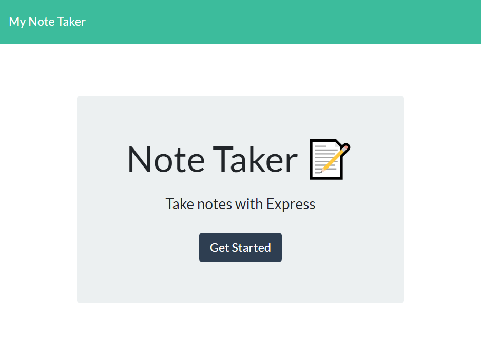

# My-Note-Taker 
[](https://choosealicense.com/licenses/mit/)


    
### Description
Create an application that can be used to write, save, and delete notes. This application will use an express backend and save and retrieve note data from a JSON file.

---

#### Table of Contents
- [Description](#description)
- [User Story](#user)
- [Technologies Used](#technologies)
- [License](#license)
- [Questions](#questions)

---

### User Story

```
AS A user, I want to be able to write and save notes

I WANT to be able to delete notes I've written before

SO THAT I can organize my thoughts and keep track of tasks I need to complete
```

### Technologies Used
Technologies to be filled in later.

#### License
This project is licensed under MIT. 

#### Questions
    
If you have any questions, please [email me.](mailto:aiden.threadgoode@gmail.com)
If you'd like to see more of my work, feel free to check out [my github!](https://github.com/a-thread)

*© 2020 Aiden Threadgoode*
    